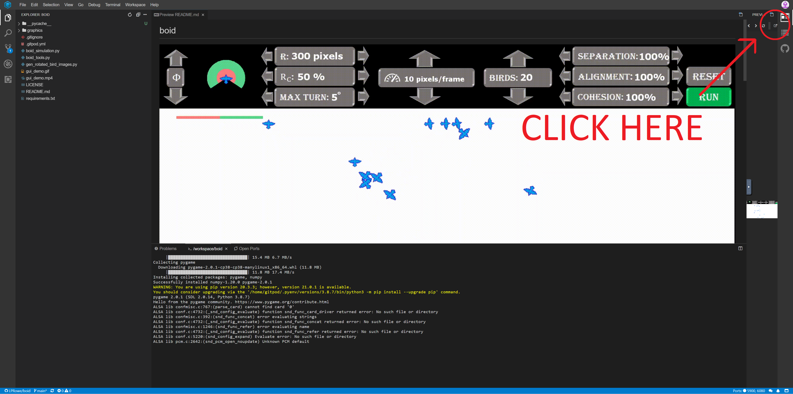

Simulation of bird flocking behavior with variable parameters for the bird's field of vision, speed, turning radius, desire to spread out or cluster together, as well as a few others listed below. 

# Try it yourself.

Method 1:  
1. Clone this repo and run boid_simulator.py in python3 the only dependencies that are not built into python are numpy and pygame

Method 2: 
1. Right click the Gitpod button below and select open in new tab
2. Wait a minute, it takes a little time for Gitpod to start up
3. Pop out the boid window by clicking as shown below (click two times if necessary)
4. The simulation run speed is different in Gitpod, if it is running too fast, tap s to slow the simulation down or tap f to speed the simulation up

# Keyboard / Mouse Controls

<b>&phi;</b>: Birds field of view 
<b>R</b>: Distance that each bird can see 
<b>Rc</b>: Boids will try to avoid objects in the visible range that are closer than Rc&middot;R 
<b>Max Turn</b>: The maximum change in trajectory that a bird can make in one frame. 
<b>Speed</b>: The pixels per frame that each bird travels. 
<b>Birds</b>: The number of birds present, reducing birds pops from the bird list, increasing birds randomly spawns new birds. 
<b>Separation</b>: Coefficient that drives birds desire to spread out from one another. 
<b>Alignment</b>: Coefficient that drives birds desire to align with other birds in their field of view. 
<b>Cohesion</b>: Coefficient that drives birds desire to travel as a flock. 
<b>key f</b>: Increases the frame rate of the simulation. (faster) 
<b>key s</b>: Decreases the frame rate of the simulation. (slower) 

# What is a boid?

Boid is short for bird-oid meaning bird like.   
A boid object follows three simple rules:
1. Separation: Boids try to maintain a safe distance from other boids in their field of view.
2. Alignment: Boids like to align their trajectories with other boids in the flock.
3. Cohesion: While boids repel each other through separation, they also like to flock together for safety and will be attracted to other groups of boids.

When all three rules are applied to each boids in a set of boids, the boids appear to behave similarly to a flock of birds.  This is an example of emergent behavior.  

# Some things to try:

Adjust the parameters to see different types of behaviors that emerge.

- [ ] Set separation coefficient to 0 and increase the birds turning radius.
- [ ] Set Rc to 100%.
- [ ] How does increasing the bird speed affect their ability to flock together and avoid walls? 
- [ ] Does increasing max turn help?
- [ ] Set speed and separation to 0, then adjust the birds field of view (phi and R) to watch how their behavior changes in place.  
- [ ] Change cohesion to 0 and separation to 100, how does this affect the birds behavior?

## Some of my other projects:

<b>
1. <a href="https://github.com/LPRowe/path-finding-visualizer">Path finding visualizer for A*, BFS, and mulltisource BFS</a> 
2. <a href="https://github.com/LPRowe/genetic-algorithm">Trained an AI to play snake (reinforcment learning)</a> 
3. <a href="https://github.com/LPRowe/traveling-salesman-problem">Heuristic solutions to the traveling salesman problem (TSP)</a> 
4. <a href="https://github.com/LPRowe/coding-interview-practice">Solutions to data structures and algorithms problems</a> 
5. <a href="https://github.com/LPRowe/3D-nanopore-reconstruction">Rendered 3D models of nanopores from 2D SEM images</a> 
6. <a href="https://github.com/LPRowe/bowtie-defect-identification">Trained an ML model to detect microcracks from infrared images</a> 
7. <a href="https://github.com/LPRowe/sudoku">Sudoku solver, puzzle generator, and playable game (backtracking and logic)</a> 
8. <a href="https://github.com/LPRowe/connect-four-kaggle">Play connect four against a neural network</a> 
9. <a href="https://github.com/LPRowe/titanic">Predicted who would survive the titanic</a> 
</b>